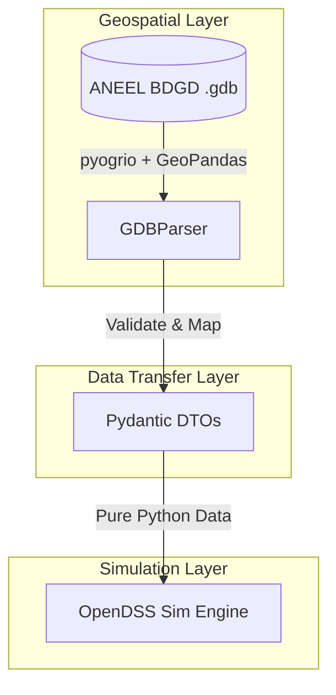

# System Architecture

This project is built using Clean Architecture principles to decouple the geospatial processing engine from the simulation engine. This isolates the grid simulation core from complex GIS/GDAL dependencies and makes testing straightforward.

## Data Decoupling via DTOs

The system is structured as follows:

### 1. Geospatial Layer (`src/bdgd_tools/core/gdb_parser.py`)
- Responsible for identifying and loading geospatial tables from ANEEL's Geodatabase.
- Uses `pyogrio` with GDAL C API bindings via Apache Arrow to ensure minimal memory footprint and fast ingestion times.

### 2. Data Transfer Layer (`src/bdgd_tools/core/models.py`)
- Houses `pydantic.BaseModel` DTOs (Data Transfer Objects) that represent physical grid components.
- Validates properties at runtime (e.g., ensuring nominal powers and voltages are strictly greater than zero).
- Acts as a strict boundary, preventing GIS data frames from bleeding into the simulation logic.

### 3. Simulation Layer
- Drives OpenDSS directly using the simulation engine.
- Consumes only clean Python DTOs, enabling mock-based, database-free testing of simulation logic.
