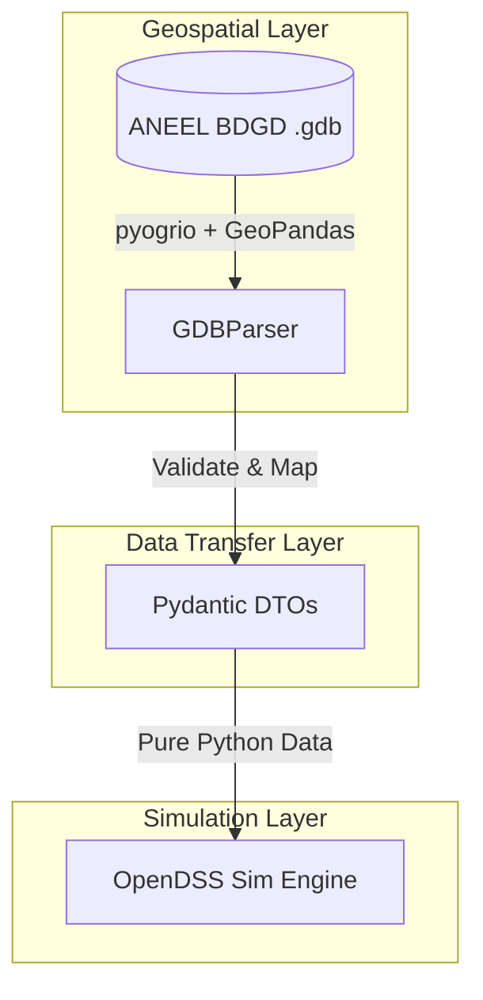

# Documentation Infrastructure Implementation Plan

> **For Antigravity:** REQUIRED WORKFLOW: Use `.agent/workflows/execute-plan.md` to execute this plan in single-flow mode.

**Goal:** Create a comprehensive, modular documentation layout (README.md, architecture.md, regulatory.md, development.md) and update GEMINI.md to enforce plan-integrated documentation during feature development.

**Architecture:** A modular layout in the root and under `docs/` that decouples high-level guidelines, software architecture, regulatory details, and developer guides.

**Tech Stack:** Markdown, Git

---

### Task 1: Update GEMINI.md

**Files:**
- Modify: `GEMINI.md`

**Step 1: Write the instructions update**
Add a 7th rule to the Operational Workflow & Mentorship section (Section 4) in `GEMINI.md` requiring plan-integrated documentation updates for every task.

Target insertion point:
```markdown
34: 1.  **User Drives Execution:** This is a learning project. The user types everything and executes every terminal command. You provide the blueprints, suggest code modifications, and provide the exact commands to execute. Do not run commands directly yourself.
...
39: 6.  **Profiling & Optimization:** Teach the user code profiling. When bottlenecks are discovered (especially parsing large Geodatabases), guide the user in searching for and implementing optimized solutions.
```

New item to add:
```markdown
39: 6.  **Profiling & Optimization:** Teach the user code profiling. When bottlenecks are discovered (especially parsing large Geodatabases), guide the user in searching for and implementing optimized solutions.
40: 7.  **Continuous Documentation:** Maintain documentation as a first-class citizen. Every implementation plan must explicitly include a verification check for updating documentation. No task or code feature is considered complete until its relevant documentation (e.g., `README.md` or modular guides in `docs/`) is updated and verified.
```

**Step 2: Verify changes**
Verify that the rule is present in `GEMINI.md` and reads correctly.

**Step 3: Commit**
Guide the user to commit the changes:
```bash
git add GEMINI.md
git commit -m "docs: add continuous documentation rule to GEMINI.md"
```

---

### Task 2: Create Root README.md

**Files:**
- Create: `README.md`

**Step 1: Write implementation**
Create a comprehensive `README.md` at the root of the project.

Content for `README.md`:
```markdown
# Grid Connection Analysis Automation (1~5 MW PV)

Automate power flow calculations and grid integration impact studies for Solar Power Plants (UFV) ranging from 1 to 5 MW to validate, contest, and minimize the financial impact of network upgrade requirements issued by utilities.

## Core Objective
Strictly validate utility grid connection proposals and identify opportunities to avoid unnecessary network upgrades (re-conductoring, substation expansions) by proving the existing grid infrastructure compliance with ANEEL's **PRODIST Módulo 8** standards (specifically steady-state voltage deviation limits: $0.95 \le V_{pu} \le 1.05$).

## Project Structure
- `src/bdgd_tools/`: Parser and tools for ANEEL's Base de Dados Geográfica da Distribuidora (BDGD).
  - `core/models.py`: Pydantic Data Transfer Objects (DTOs) for grid assets.
  - `core/gdb_parser.py`: High-performance File Geodatabase parser using GeoPandas and pyogrio.
- `tests/`: Automated unit and integration tests.
- `docs/`: Comprehensive documentation and implementation plans.
- `data/`: Placeholder for BDGD File Geodatabase (.gdb) inputs (not committed to git).

## Setup & Installation

This project uses Python >= 3.10. Install the package in editable mode with test dependencies:

```bash
pip install -e ".[test]"
```

## Running Tests
Run tests using pytest:
```bash
pytest
```

## Documentation Index
For detailed technical documentation, refer to:
- [System Architecture](docs/architecture.md) — Decoupled design, GDBParser, and Pydantic models.
- [Regulatory Framework](docs/regulatory.md) — PRODIST Módulo 8 details and grid compliance checks.
- [Development Guide](docs/development.md) — Mentorship rules, coding standards, and repository workflows.
```

**Step 2: Verify file exists and links are correct**
Ensure the root `README.md` is present and markdown formatting is correct.

**Step 3: Commit**
Guide the user to commit:
```bash
git add README.md
git commit -m "docs: create comprehensive root README.md"
```

---

### Task 3: Create System Architecture Guide (docs/architecture.md)

**Files:**
- Create: `docs/architecture.md`

**Step 1: Write implementation**
Create the architectural decoupling guide.

Content for `docs/architecture.md`:
```markdown
# System Architecture

This project is built using Clean Architecture principles to decouple the geospatial processing engine from the simulation engine. This isolates the grid simulation core from complex GIS/GDAL dependencies and makes testing straightforward.

## Data Decoupling via DTOs

The system is structured as follows:



### 1. Geospatial Layer (`src/bdgd_tools/core/gdb_parser.py`)
- Responsible for identifying and loading geospatial tables from ANEEL's Geodatabase.
- Uses `pyogrio` with GDAL C API bindings via Apache Arrow to ensure minimal memory footprint and fast ingestion times.

### 2. Data Transfer Layer (`src/bdgd_tools/core/models.py`)
- Houses `pydantic.BaseModel` DTOs (Data Transfer Objects) that represent physical grid components.
- Validates properties at runtime (e.g., ensuring nominal powers and voltages are strictly greater than zero).
- Acting as a strict boundary, preventing GIS data frames from bleeding into the simulation logic.

### 3. Simulation Layer
- Drives OpenDSS directly using the simulation engine.
- Consumes only clean Python DTOs, enabling mock-based, database-free testing of simulation logic.
```

**Step 2: Verify file layout**
Confirm file is generated successfully in the `docs` directory.

**Step 3: Commit**
Guide the user to commit:
```bash
git add docs/architecture.md
git commit -m "docs: create docs/architecture.md explaining decoupling architecture"
```

---

### Task 4: Create Regulatory Guide (docs/regulatory.md)

**Files:**
- Create: `docs/regulatory.md`

**Step 1: Write implementation**
Create the regulatory compliance guide.

Content for `docs/regulatory.md`:
```markdown
# Regulatory Compliance Framework

All analyses and automated validations are designed to strictly comply with the requirements defined by ANEEL (Agência Nacional de Energia Elétrica).

## PRODIST Módulo 8

Our compliance engine checks steady-state voltage deviation limits as defined by **PRODIST Módulo 8 (Quality of Electric Energy)**.

### Voltage Deviation Limits
Steady-state voltage at the Point of Common Coupling (PCC) must be maintained within the following range:

$$0.95 \le V_{pu} \le 1.05$$

Where:
- $V_{pu}$ is the per-unit voltage calculated relative to the nominal voltage of the grid segment.

### Grid Integration Impact Study
When simulating a Solar Power Plant (UFV) ranging from 1 to 5 MW:
1. **Base Case:** Evaluate the feeder's voltage profile under standard loading conditions without generation.
2. **Generation Case:** Inject the PV generator's peak capacity (1 to 5 MW) at the PCC.
3. **Assessment:** Verify if the voltage profile remains within the PRODIST limits ($0.95 \le V_{pu} \le 1.05$) and verify conductor thermal limits (ampacity).
4. **Contestation Strategy:** If the utility claims upgrade requirements are needed, we use the simulation results to check if the utility's expansion plans are truly necessary or if they can be avoided by optimizing control settings (e.g., active/reactive power control curves on the PV inverters).
```

**Step 2: Verify file layout**
Confirm file is created in `docs/regulatory.md`.

**Step 3: Commit**
Guide the user to commit:
```bash
git add docs/regulatory.md
git commit -m "docs: create docs/regulatory.md detailing PRODIST standards"
```

---

### Task 5: Create Developer Guide (docs/development.md)

**Files:**
- Create: `docs/development.md`

**Step 1: Write implementation**
Create the developer guidelines and workflow rules.

Content for `docs/development.md`:
```markdown
# Developer Guide & Coding Standards

This project is structured as a learning repository following a strict mentorship model.

## Mentorship Workflow
All development is user-driven. The agent provides designs, instructions, and exact terminal commands, and the user executes them.

## Coding Standards

### 1. Style & Guidelines
- Strict adherence to **PEP 8** style guidelines.
- 4-space indentation.

### 2. Type Hinting
- 100% type hinting using the native `typing` module or Python 3.10+ native pipe syntax.
- No implicit or explicit `Any` types without solid documentation.

### 3. Documentation Style
- All modules, classes, and methods must have comprehensive Google or Sphinx-style docstrings.
- Docstrings must list:
  - **Parameters** (with types and descriptions)
  - **Raises** (exceptions thrown)
  - **Returns** (types and descriptions)

### 4. Continuous Documentation Rule
Before marking any implementation task as complete, the corresponding documentation must be reviewed and updated. Ensure links are kept fully updated.
```

**Step 2: Verify file layout**
Confirm file is created.

**Step 3: Commit**
Guide the user to commit:
```bash
git add docs/development.md
git commit -m "docs: create docs/development.md with standards and workflow guidelines"
```

---

### Task 6: Update docs/plans/task.md

**Files:**
- Modify: `docs/plans/task.md`

**Step 1: Write implementation**
Update `docs/plans/task.md` to reflect that the GDB parser task is paused (or remains in progress) and list our new documentation setup tasks, marking them complete as we proceed.
Since this task is done during implementation execution, we will create the checklist entries in the task tracker.

**Step 2: Verify file layout**
Confirm the task list is correctly formatted.

**Step 3: Commit**
Guide the user to commit:
```bash
git add docs/plans/task.md
git commit -m "docs: update task list tracking"
```
